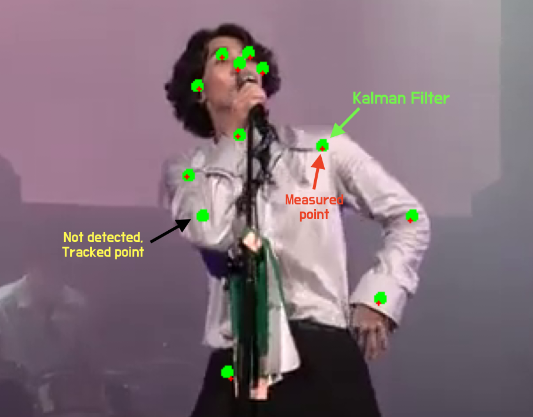

# Kalman filter for image

Basic kalman filter for image object tracking, noise remove. <br>
 - 2D optimization code (replace matrix inverse --> matrix multiplication)
 - pre&post process interface and example
 - Only depends on "numpy"

### keypoints stablizing & tracking
<p align="center">
    
    <br>
    :metal: **rock 'n' roll** :metal:
</p>

## Requirements
- python 3
- numpy
- pandas
- opencv-contrib-python


## Usage  

First, install libs

    pip install opencv-contrib-python
    pip install numpy
    pip install pandas

**Just run!** <br>

    python main.py

-----

## Description

<p align="center">
    
    <br>
    17 human pose keypoints (coco style)
</p>


### matrix
    x = [x_postition, x_velocity, y_position, y_velocity]

```
    self.dt = dt                            # time interval
    self.A = np.array([                     # system matrix
        [1, dt, 0,  0],
        [0,  1, 0,  0],
        [0,  0, 1, dt],
        [0,  0, 0,  1],
    ], dtype=np.float)
    self.H = np.array([                     # system matrix
        [1, 0, 0, 0],
        [0, 0, 1, 0]
    ])
    self.Q = 0.9*np.eye(4, dtype=np.float)  # system error matrix
    self.R = np.array([                     # measurement error matrix
        [100, 0],
        [0, 100]
    ], dtype=np.float)
```